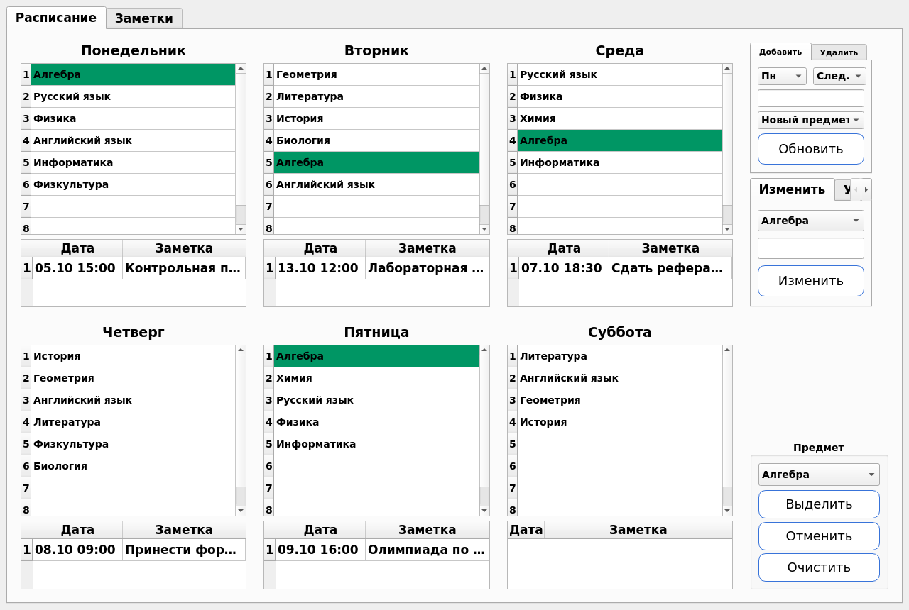
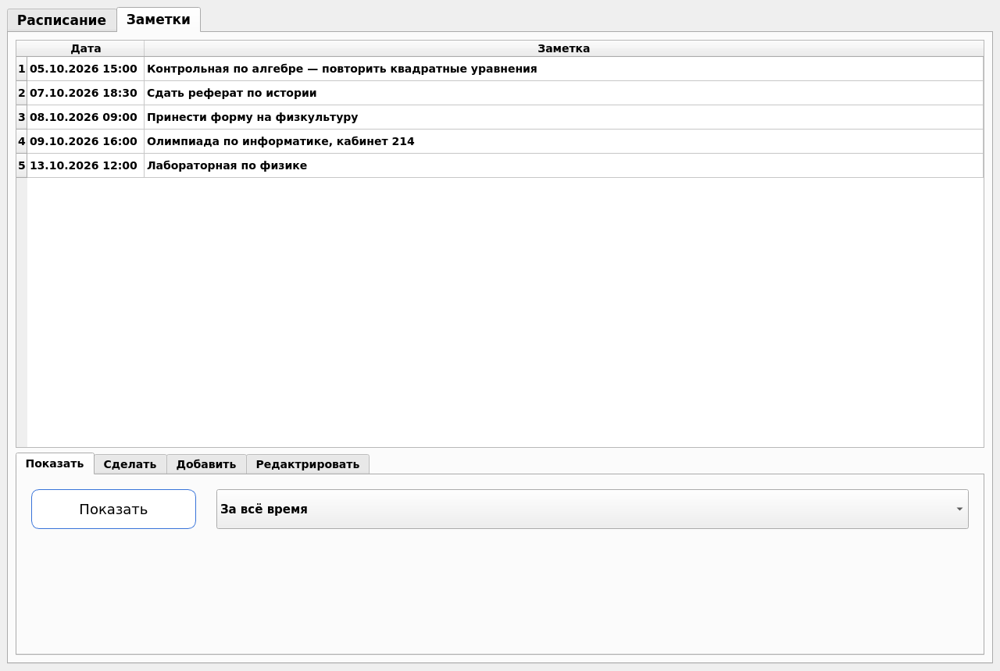

# School Table

[Русский](README.md) · **English**

[](https://github.com/EDeev/school_table/actions/workflows/ci.yml)
[](https://github.com/EDeev/school_table/releases)

A desktop student planner on PyQt5: a weekly timetable and dated notes that show up under the right day
on their own. The interface is in Russian.

**Status:** coursework (2021), completed



**Stack:** Python 3 · PyQt5 · SQLite

## Features

- A grid of six school days, up to eight lessons a day
- Subject list: add, rename, delete (the subject also disappears from the timetable), clear a lesson
- Highlighting a chosen subject across the whole week
- Notes with date and time: shown under the timetable by weekday, and on the Notes tab as one list for
  all time, the coming month or the coming week
- Editing a note and marking it done (a done note is deleted)
- Everything is stored locally in `table.db`

## Running

A ready-made Windows build is `SchoolTable-windows.zip` in the
[releases](https://github.com/EDeev/school_table/releases): unpack it and run `SchoolTable.exe` (keep
`table.db` next to it).

From source:

```bash
git clone https://github.com/EDeev/school_table.git && cd school_table
pip install -r requirements.txt
python main.py
```

## Screenshots



## License

Coursework (2021). The code is open for study; there is no separate license.

## Author

**Egor Deev** — [GitHub](https://github.com/EDeev) · [Telegram](https://t.me/DeevEgor) · [egor@deev.space](mailto:egor@deev.space)

---

<div align="center">
  <sub>⭐ If you find this project useful, give it a star on GitHub!</sub>
  <p><sub>Made with ❤️ — <a href="https://deev.space">deev.space</a></sub></p>
</div>
